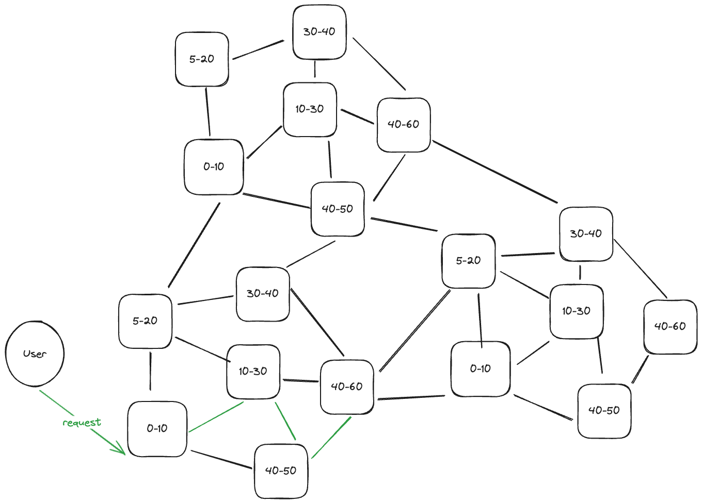

# Decentralized LLM Inference Runner

This project aims to create a decentralized LLM (Large Language Model) inference system powered by and for users. The core concept is to split large LLM models into smaller parts that can fit within users' devices, all of which are interconnected through a peer-to-peer (P2P) network.

One significant challenge with LLMs is that they can have hundreds of layers, requiring substantial memory to run locally. Most consumer devices today have around 16GB of memory, and running an 8-billion-parameter model typically consumes about 50% of that memory (8GB), not accounting for the operating system and other daily applications. Additionally, the model often remains idle. We address this by dividing the model into smaller parts, with each device handling only a small portion—ideally around 10%.

During LLM inference, each generated token must be processed across all layers, with each layer requiring 10KB to 50KB of data transfer. When the model is distributed across 10 nodes, this becomes bandwidth-intensive and increases latency, especially if the layer chain involves users from different regions. To mitigate this, we developed a decentralized routing technique that identifies the shortest chains across multiple nodes, ensuring the LLM layer chain is formed with the lowest possible latency.

## Real-World Usability and Applications

We have some thoughts on this: the closer the users are to each other, the more likely they are to use the same models. For example, users in the same region may prefer models fine-tuned for their language. Another case could be a group of students or engineers within a company who are more likely to share and use similar models.

For this reason, we believe that our shortest-chain routing technique can significantly optimize latency, especially when users are connected via LAN or are very close peers. By prioritizing these local connections, the system can reduce data transfer times and improve overall performance, making decentralized LLM inference more efficient and practical.

## How It Works with Blockchain

Each device will have its own wallet or be linked to the user's wallet.

Devices earn small rewards by staying active and serving other users' requests.

Users incur a cost for processing each request, which depends on the input and output tokens.

Whenever a user submits a request, it is secured by a chain of contributing devices through data hashes and signatures, providing proof of contribution.

## Some thought about marketplace

Each node can set its desired cost for services, while users can specify the maximum cost they are willing to accept and their latency requirements. Based on these parameters, the network routes requests to the most suitable nodes.

Users can add funds to their wallets to purchase more resources. They are free to use these resources internally or act as resellers, offering them to other Web2 or Web3 users.

## Visualization with a 60-Layer Model

Imagine a scenario where a 60-layer LLM is split across multiple devices within a decentralized network. In a traditional setup, this model would require substantial memory and computational power on a single device, likely exceeding the capabilities of most consumer hardware. However, by distributing the model:

1. Layer Distribution:

- The 60 layers are divided among 4 devices, with each device handling 10-20 layers. This significantly reduces the memory and processing burden on each individual device, making it feasible for regular consumer hardware to participate.

2. Data Flow:

- When a token is generated, it passes through the first 10 layers on Device 1, then moves to Device 2 for the next 20 layers, and so on, until all 60 layers are processed. Each layer transfer involves 10KB to 50KB of data, depending on the complexity of the layer.

3. Latency Optimization:

- Using the shortest-chain routing technique, the system ensures that the token passes through the nearest available devices. If 5 of the 10 devices are within a local network (LAN), since LAN connections have lower latency, the network will automatically prioritize and select them, minimizing latency and optimizing overall performance.

This visualization demonstrates how even a relatively complex model, like one with 60 layers, can be made usable in the real world through decentralization. It opens up possibilities for deploying advanced AI applications in everyday environments, leveraging the collective power of distributed computing.

## Testing Model (WIP)

Phi-3 (32 layers)
